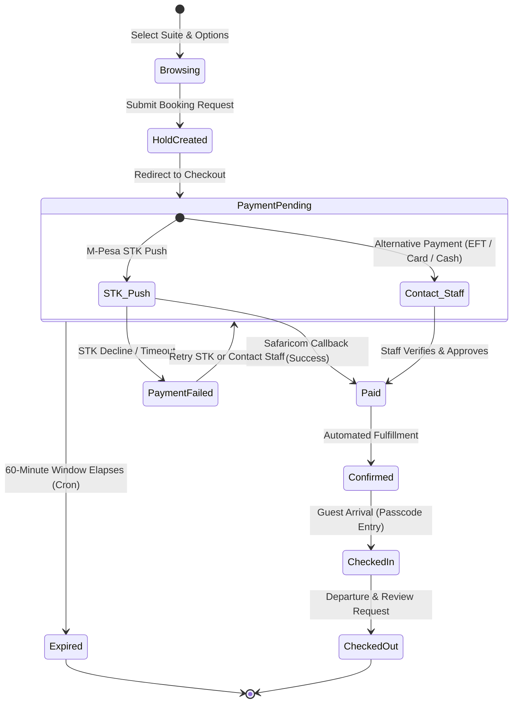

# Lulu Aurelian Estate — Comprehensive System Workflow

> **Document Version:** 2.0  
> **Core Stack:** React 19 (Vite) + Node.js/Express + MySQL 8.0 (with in-memory fallback) + Safaricom Daraja M-Pesa API + Concierge Operations

---

## Table of Contents
1. [System Architecture Overview](#1-system-architecture-overview)
2. [End-to-End Guest Booking Lifecycle](#2-end-to-end-guest-booking-lifecycle)
3. [Pricing Engine & Rate Determination](#3-pricing-engine--rate-determination)
4. [Payment Processing & Webhook Workflows](#4-payment-processing--webhook-workflows)
5. [Automated Post-Payment Fulfillment & Check-In](#5-automated-post-payment-fulfillment--check-in)
6. [Staff & Concierge Operations Workflow](#6-staff--concierge-operations-workflow)
7. [Automated Background Services & Cron Jobs](#7-automated-background-services--cron-jobs)
8. [Database Schema & Entity Relationships](#8-database-schema--entity-relationships)
9. [API Route Directory](#9-api-route-directory)
10. [Error Handling & High Availability Strategy](#10-error-handling--high-availability-strategy)

---

## 1. System Architecture Overview

Lulu Aurelian Estate is structured as a decoupled full-stack hospitality platform divided into three main operational tiers:

```
┌────────────────────────────────────────────────────────────────────────┐
│                          PRESENTATION TIER                             │
├─────────────────────────────────────┬──────────────────────────────────┤
│  Client-Facing Web App (React/Vite) │  Staff PWA & Portals (React)     │
│  - Suite Discovery & Virtual Tours  │  - Concierge / Agent Portal Desk │
│  - Dynamic Pricing & Room Modes     │  - Manager Pricing Engine        │
│  - Interactive Calendar & Booking   │  - Suite Passcode & Wi-Fi Vault  │
│  - Multi-Gateway Checkout           │  - Review Moderation & Content   │
└──────────────────┬──────────────────┴──────────────────┬───────────────┘
                   │                                     │
                   ▼                                     ▼
┌────────────────────────────────────────────────────────────────────────┐
│                           APPLICATION TIER                             │
│                  Node.js + Express REST API Server                     │
├────────────────────────────────────────────────────────────────────────┤
│  Controllers:  Booking | Payment | Pricing | Auth | Review | CMS       │
│  Security:     JWT Authentication, RBAC, Rate-Limiting, Helmet, CORS   │
│  Services:     M-Pesa Daraja, Stanbic Bank, PayPal, Nodemailer, Cron   │
└──────────────────────────────────┬─────────────────────────────────────┘
                                   │
                                   ▼
┌────────────────────────────────────────────────────────────────────────┐
│                              DATA TIER                                 │
│               MySQL 8.0 (Railway / WampServer / Cloud)                 │
│         (Automatic Failover: High-Fidelity In-Memory Store)            │
├────────────────────────────────────────────────────────────────────────┤
│  Tables: bookings, payments, unit_pricing, unit_settings, users,       │
│          processed_webhook_events, reviews, newsletters                │
└────────────────────────────────────────────────────────────────────────┘
```

---

## 2. End-to-End Guest Booking Lifecycle

The journey from a visitor landing on the website to checking into their suite follows a strict state-machine lifecycle:



### Stage 1: Suite Discovery & Customization
1. **Selection:** Guest views suites (`Skyview Penthouse`, `Cocoa Retreat`, `Neema Haven`).
2. **Booking Type Selection:** Guests choose either:
   - **Entire Apartment:** Full 2-bedroom access with living room, kitchen, and balcony.
   - **1-Bedroom Option:** Private king bedroom access at a reduced single/double rate.
3. **Calendar Availability Check:**
   - Client queries `GET /api/bookings` (or cached blocked dates).
   - Past dates, confirmed bookings (`PAID`, `APPROVED`), and active temporary holds (`PENDING` where `hold_expires_at > NOW()`) are disabled on the calendar.

### Stage 2: Hold Creation (`POST /api/bookings/request`)
1. Guest submits contact details (Name, Email, Phone), dates (`check_in`, `check_out`), guest count (`adults`, `children`), and `booking_type`.
2. **Server Validation:**
   - Verifies check-out is strictly after check-in.
   - Checks against all overlapping non-expired bookings for that specific `unit_id`.
   - Generates a unique, high-entropy `secure_token` (e.g., `sec_token_...`).
3. **Database Insertion:**
   - Inserts record into `bookings` table with status `PENDING`.
   - Computes `hold_expires_at = DATE_ADD(NOW(), INTERVAL 1 HOUR)`.
   - This holds the calendar slot for **60 minutes**, preventing race conditions and double-booking while the guest enters payment details.
4. **Response:** Returns `bookingId`, total calculated price, and `secureToken`.

---

## 3. Pricing Engine & Rate Determination

Pricing is dynamically computed live on both frontend and backend using synchronized rates stored in the database.

### Mathematical Formula
$$\text{Base Rate} = \begin{cases} \text{entire\_price} & \text{if booking\_type} = \text{'entire'} \\ \text{one\_bedroom\_price} & \text{if booking\_type} = \text{'one\_bedroom'} \end{cases}$$

$$\text{Nights} = \text{DateDiff}(\text{check\_out}, \text{check\_in})$$

$$\text{Subtotal} = \text{Base Rate} \times \text{Nights}$$

$$\text{Peak Multiplier} = \begin{cases} 1.15 & \text{if dates fall during Dec 15 – Jan 5 or Easter} \\ 1.00 & \text{otherwise} \end{cases}$$

$$\text{Total Price} = \text{Subtotal} \times \text{Peak Multiplier}$$

### Suite Pricing Configuration (`unit_pricing` Table)
| Suite ID | Suite Name | Default Entire Price | Default 1-Bedroom Price |
| :--- | :--- | :--- | :--- |
| `skyview` | Skyview Hideaway | KES 5,500 / night | KES 4,000 / night |
| `cocoa` | Cocoa Retreat | KES 5,000 / night | KES 4,000 / night |
| `neema` | Neema Haven | KES 5,000 / night | KES 4,000 / night |

*Managers can adjust these rates live at any moment via the Manager Portal without restarting the server.*

---

## 4. Payment Processing & Webhook Workflows

When the guest reaches the **Checkout Page**, they have two streamlined paths: **Automated M-Pesa STK Push** or **Concierge Alternative Payment Assistance**:

```
                          ┌────────────────────────┐
                          │   Guest on Checkout    │
                          └───────────┬────────────┘
                                      │
           ┌──────────────────────────┴──────────────────────────┐
           │ (Option A - Instant Automated)                      │ (Option B - Alternative Methods)
           ▼                                                     ▼
   ┌───────────────┐                                     ┌───────────────────────────────┐
   │ M-PESA DARAJA │                                     │  CONTACT STAFF / CONCIERGE    │
   │   (STK Push)  │                                     │  (EFT, Card, Wire, Cash, Inv) │
   └───────┬───────┘                                     └───────────────┬───────────────┘
           │                                                             │
   User PIN on Phone                                            WhatsApp / Phone Direct
           │                                                             │
           ▼                                                             ▼
   Safaricom Callback                                           Staff Verifies Payment
           │                                                             │
           ▼                                                             ▼
   Idempotency Check                                            Staff Approves in Portal
   (processed_webhook_events)                                    (PUT /api/bookings/:id/approve)
           │                                                             │
           └──────────────────────────┬──────────────────────────────────┘
                                      │
                                      ▼
                      ┌───────────────────────────────┐
                      │  Update Booking to 'PAID'     │
                      │  Record in 'payments' table   │
                      └───────────────┬───────────────┘
                                      │
                                      ▼
                      ┌───────────────────────────────┐
                      │ Trigger Automated Fulfillment │
                      └───────────────────────────────┘
```

### A. M-Pesa Express (Daraja STK Push)
1. **Initiation:** Guest provides their Kenyan phone number (e.g., `0712345678` or `254712345678`).
2. **Server Action (`POST /api/payments/mpesa/stkpush` or `/api/bookings/:id/pay`):**
   - Fetches OAuth token from Safaricom API.
   - Generates password using `Shortcode + Passkey + Timestamp`.
   - Dispatches STK prompt directly to guest's handset.
   - Saves `CheckoutRequestID` in memory/DB.
3. **Guest Interaction:** Enters M-Pesa PIN on their phone.
4. **Callback (`POST /api/bookings/webhook/mpesa`):**
   - Safaricom delivers asynchronous payload with `ResultCode`.
   - If `ResultCode == 0` (Success):
     - Extracts `MpesaReceiptNumber`, `Amount`, `PhoneNumber`.
     - Verifies idempotency to guard against network retries.
     - Upgrades booking status from `PENDING` $\to$ `PAID`.
     - Logs transaction into `payments` table.

### B. Concierge & Alternative Payment Methods
1. **Selection:** For international guests, corporate clients, or guests preferring alternatives to M-Pesa, the checkout provides direct concierge access for:
   - **Direct Bank Transfer (EFT / RTGS / SWIFT)**
   - **Credit / Debit Card** via physical POS terminal at front desk
   - **Corporate Invoicing & Local Company Cheques**
   - **Cash Settlement on Arrival** (subject to prior clearance)
2. **Reservation Hold Safeguard:** The 60-minute reservation hold remains active so no other guest can book the dates while the guest coordinates with the reservations team.
3. **Staff Verification & Confirmation:**
   - Guest contacts concierge via one-tap WhatsApp (`+254 112 299 384`), phone call, or email.
   - Staff verifies receipt of funds or authorizes the check-in guarantee.
   - Staff confirms the booking via the **Agent / Manager Portal** (`PUT /api/bookings/:id/approve`), transitioning the status to `PAID`/`APPROVED` and releasing automated check-in credentials.

---

## 5. Automated Post-Payment Fulfillment & Check-In

The moment a payment transitions to `PAID`, the system triggers an immediate post-booking fulfillment pipeline:

1. **Suite Passcode Retrieval:**
   - Backend queries `unit_settings` for the reserved `unit_id`.
   - Retrieves:
     - **Apartment Door Keypad Passcode** (e.g., `9841`)
     - **House Number / Floor** (e.g., `Suite 601, 6th Floor`)
     - **High-Speed Wi-Fi SSID & Password** (e.g., `LuluAurelian_Skyview_5G`)
2. **Guest Welcome & Receipt Email (`emailService.js`):**
   - Dispatches a luxury HTML receipt and check-in pack containing:
     - Booking Reference ID
     - Keyless smart lock pin code
     - Wi-Fi credentials
     - GPS pin and property directions
     - Dynamic QR code for front desk verification
3. **Manager & Concierge Instant Alert:**
   - Sends notification to property managers (`chrisine@gmail.com`, `caroline@gmail.com`) via email and WhatsApp.
   - Alerts housekeeping to prepare the suite for the upcoming arrival.

---

## 6. Staff & Concierge Operations Workflow

Staff access the dedicated Progressive Web App (PWA) via `/staff.html`.

### Access Control Matrix
| Feature / Action | Guest | Agent (Concierge) | Manager (Executive) |
| :--- | :---: | :---: | :---: |
| Browse Suites & Book Online | ✅ | ✅ | ✅ |
| View Live Room Passcodes | ❌ | ✅ | ✅ |
| Approve / Decline Pending Holds | ❌ | ✅ | ✅ |
| Mark Guest Checked-In / Checked-Out | ❌ | ✅ | ✅ |
| Edit Dynamic Suite Base Rates | ❌ | ❌ | ✅ |
| Moderate Guest Reviews (Publish/Delete) | ❌ | Publish Only | Full Control |
| Manage Staff Accounts & Passwords | ❌ | ❌ | ✅ |

### Operations Portals

#### 1. Concierge & Agent Portal (`AgentPortal.jsx`)
- **Live Booking Feed:** Polls active reservations with real-time status badges (`PAID`, `PENDING`, `EXPIRED`).
- **One-Click WhatsApp Dispatch:** Generates pre-formatted WhatsApp messages for guests with door passcodes and directions.
- **Door Passcode Vault:** Quick-copy interface for smart lock keycodes when assisting arriving guests.

#### 2. Manager Hub (`ManagerPortal.jsx`)
- **Live Pricing Engine:** Sliders and inputs to adjust `entire_price` and `one_bedroom_price` per suite. Changes write directly to `unit_pricing` and take effect immediately on the public site without redeployment.
- **Security & Keypad Settings:** Ability to cycle digital door lock PIN codes upon guest checkout for maximum security.
- **Review Moderation Studio:** Screen public testimonials before they appear on the homepage.

---

## 7. Automated Background Services & Cron Jobs

The backend runs an automated scheduler (`cronService.js`) with three main tasks:

```
[Cron Job] Every 5 Minutes
  │
  ├─► Scan 'bookings' WHERE status = 'PENDING' AND hold_expires_at <= NOW()
  │     └─► UPDATE status = 'EXPIRED'
  │     └─► Release calendar dates back to inventory
  │
  ├─► Daily 09:00 EAT: Check-In Reminder Hook
  │     └─► Filter arrivals for today -> Send door codes & welcome WhatsApp
  │
  └─► Daily 12:00 EAT: Checkout & Review Request Hook
        └─► Filter departures for today -> Send thank-you note & review invite
```

### Calendar Synchronization (iCal)
- Provides standard `.ics` calendar feeds at `/api/ical/:unitId`.
- Allows external platforms (Airbnb, Booking.com, VRBO) to sync dates and prevent multi-platform cross-booking.

---

## 8. Database Schema & Entity Relationships

The MySQL database schema is structured for performance, relational integrity, and financial auditing:

```
 ┌───────────────────────────┐         ┌───────────────────────────┐
 │         bookings          │1       *│         payments          │
 ├───────────────────────────┤─────────├───────────────────────────┤
 │ id (UUID/VARCHAR) [PK]    │         │ id (INT AUTO_INC) [PK]    │
 │ unit_id (VARCHAR)         │         │ booking_id (VARCHAR) [FK] │
 │ booking_type (VARCHAR)    │         │ amount (DECIMAL)          │
 │ check_in (DATE)           │         │ gateway (ENUM)            │
 │ check_out (DATE)          │         │ status (VARCHAR)          │
 │ total_price (DECIMAL)     │         │ transaction_ref (VARCHAR) │
 │ status (ENUM)             │         │ idempotency_key (VARCHAR) │
 │ hold_expires_at (TS)      │         │ created_at (TIMESTAMP)    │
 │ secure_token (VARCHAR)    │         └───────────────────────────┘
 └─────────────┬─────────────┘
               │*
               │ (Logical Mapping by unit_id)
               ▼1
 ┌───────────────────────────┐         ┌───────────────────────────┐
 │       unit_pricing        │         │       unit_settings       │
 ├───────────────────────────┤         ├───────────────────────────┤
 │ unit_id (VARCHAR) [PK]    │         │ unit_id (VARCHAR) [PK]    │
 │ entire_price (DECIMAL)    │         │ passcode (VARCHAR)        │
 │ one_bedroom_price (DEC)   │         │ house_number (VARCHAR)    │
 │ updated_at (TIMESTAMP)    │         │ wifi_ssid (VARCHAR)       │
 └───────────────────────────┘         │ wifi_password (VARCHAR)   │
                                       └───────────────────────────┘
```

---

## 9. API Route Directory

### Public Client Endpoints
- `GET  /api/pricing` — Live suite pricing for Entire Apartment & 1-Bedroom modes.
- `POST /api/bookings/request` — Create 1-hour reservation hold.
- `GET  /api/bookings/status?token=:token` — Guest status and verification lookup.
- `GET  /api/reviews` — Fetch approved public guest testimonials.
- `POST /api/reviews/submit` — Submit a post-stay review.
- `POST /api/newsletters/subscribe` — Join newsletter list.

### Payment & Webhook Endpoints
- `POST /api/payments/mpesa/stkpush` — Trigger M-Pesa STK phone prompt.
- `POST /api/bookings/:id/pay` — Public/Guest booking M-Pesa payment initiation.
- `POST /api/bookings/webhook/mpesa` — Safaricom Daraja callback and instant booking confirmation.

### Authenticated Staff Endpoints (`Authorization: Bearer <JWT>`)
- `POST /api/auth/login` — Authenticate staff member.
- `GET  /api/auth/me` — Retrieve current user identity and permissions.
- `GET  /api/bookings` — Fetch all bookings with search/filter capabilities.
- `PUT  /api/bookings/:id/approve` — Manually approve pending booking.
- `PUT  /api/bookings/:id/decline` — Decline booking.
- `PUT  /api/pricing` *(Manager only)* — Update suite base rates live.
- `GET  /api/users` *(Manager only)* — List system users.
- `PUT  /api/reviews/:id/moderate` — Approve or retract guest review.
- `DELETE /api/reviews/:id` *(Manager only)* — Permanently remove review.

---

## 10. Error Handling & High Availability Strategy

1. **Dual-Tier Database Fallback:**
   - If MySQL connection drops or experiences downtime, `server/config/db.js` automatically routes queries to the High-Fidelity In-Memory Store without crashing the Express server.
   - Prevents booking downtime during database maintenance or network blips.
2. **Double-Spend & Idempotency Guard:**
   - Every gateway webhook transaction records its unique transaction ID into `processed_webhook_events`.
   - Repeated webhook retries from payment providers are recognized and acknowledged without double-crediting or duplicate customer emails.
3. **Graceful Degradation:**
   - If third-party email or WhatsApp delivery experiences high latency or timeout, the payment transaction still completes successfully, and credentials remain retrievable via the guest's unique booking status link.
